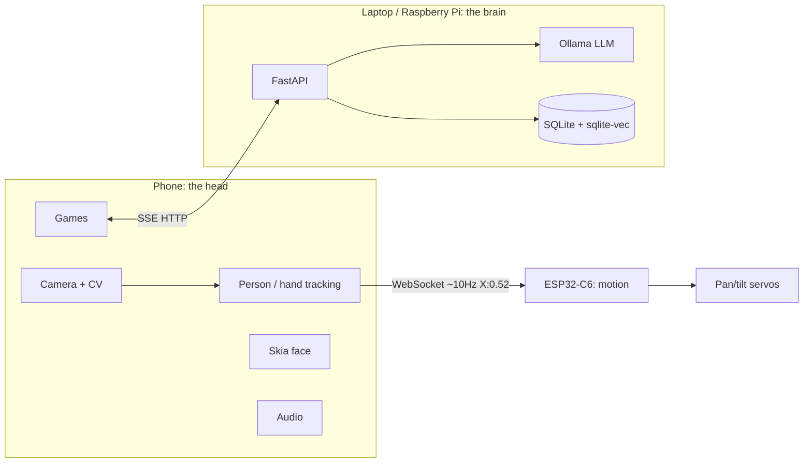

# PLAN.md — DUO Software Repository Build Plan

This plan builds the software side of DUO, a mobile rehabilitation companion robot. It is written for Claude Code to execute phase by phase, task by task, in order. Each task is small enough for one session and states file paths, packages, and acceptance criteria.

## How to use this plan

- I will ask you to run one phase at a time ("do Phase 4"). Execute every task in that phase automatically, in order, then stop and wait for me.
- Do not start the next phase until I ask for it, and until the current phase's Definition of Done passes.
- Each task is a checkbox. Tick it only when its acceptance criteria are met.
- Where a task says "verify first", run the stated verification before writing dependent code. Hardware behavior and fast-moving library APIs cannot be assumed.

## Git rules (read before writing any code)

You never touch git state. I own every commit.

Do NOT run: `git init`, `git add`, `git commit`, `git push`, `git tag`, `git checkout`, `git branch`, `git merge`, `git stash`, `git reset`, `git restore`, `git rm`. Read-only commands (`git status`, `git diff`, `git log`) are allowed when you need to inspect state.

After finishing each task, print a commit block in exactly this format:

```
--- COMMIT 2.3 ---
git add server/duo_server/llm/ollama_client.py
git add server/tests/test_llm.py

feat(server): add Ollama client wrapper
```

Rules for the commit block:

- One `git add` line per file, with the real relative path. Never `git add .` and never `git add -A`.
- For a deleted file, print `# git rm <path>` as a comment line. Do not run it. I decide.
- The commit message is one conventional-commit line, under 72 characters. No task number inside the message (the block header already carries it).
- Allowed types: `feat`, `fix`, `docs`, `chore`, `test`, `refactor`, `build`. Allowed scopes: `server`, `app`, `firmware`, `docs`, `repo`.
- If a task produces no file changes, print `--- COMMIT N.M --- (no changes)`.
- If a later task in the same phase edits a file an earlier task already listed, list it again under the later task and add the comment line `# also modified in COMMIT N.M`.

At the end of every phase, print a consolidated **Commit Sheet**: every task's commit block in order, ready for me to paste one at a time. Then stop and wait for my next instruction. Do not summarize the next phase, do not start it.

## Product summary (source of truth)

DUO is a roughly 4-foot mobile companion robot for people with limited mobility in rehabilitation. Product line: "DUO is a mobile rehabilitation companion that turns prescribed movement and cognitive exercises into playful interactions, giving people in recovery a reason to move, engage, and feel less alone." Core proposition: "Rehab shouldn't feel like being alone."

Hardware already built: smartphone as the head (camera, audio, face animation, game UI, computer vision), 2-axis MG90S servo gimbal (pan approx plus/minus 40-90 degrees, tilt approx plus/minus 30 degrees), PVC body, LEGO Inventor mobile base, ESP32-C6 (Glyph-C6) controller, ultrasonic and motion sensors.

Core principle: the phone owns perception, the ESP32 owns motion, the servo creates physical attention.

Confirmed decisions:

1. Phone app is React Native / Expo.
2. The local model runs on a laptop or Raspberry Pi server on the same Wi-Fi as the phone, not on-device.
3. The repo matters equally as runnable code and as a showcase README with docs and photos.

## Architecture decisions taken in this plan (read before building)

These are the opinionated calls this plan makes. Change them only with reason.

1. **Local model serving: Ollama.** Ollama exposes an OpenAI-compatible endpoint at `/v1/chat/completions` with streaming, runs on laptop and Raspberry Pi 5, and lets the app switch backends by changing a base URL. On a Raspberry Pi 5 (8GB), community benchmarks report gemma3:1b at roughly 18-22 tokens/sec, llama3.2:1b at roughly 8 tokens/sec, deepseek-r1:1.5b at roughly 7-9 tokens/sec, llama3.2:3b at roughly 5 tokens/sec, and mistral:7b at roughly 2 tokens/sec. A laptop with a discrete GPU is far faster. Set `OLLAMA_HOST=0.0.0.0` so the phone can reach it at `http://<server-ip>:11434`.

2. **Model choice: start with a 3B-class instruct model, keep a 1B fallback.** Llama 3.2 3B or Qwen 2.5 3B for quality; Llama 3.2 1B or Gemma 3 1B when latency matters more. Make the model name a config value, never a hardcoded string.

3. **The "brain" is a Python FastAPI service, not raw Ollama.** DUO needs persona, memory, and progress persistence that plain Ollama does not provide. FastAPI wraps Ollama, injects the persona system prompt and retrieved memories, persists sessions and scores, and streams tokens to the phone over Server-Sent Events.

4. **Memory: SQLite for structured memory, sqlite-vec for semantic recall. No heavy vector server.** For a single-user companion at this scale an embedded store is the right size. Structured memory (sessions, scores, exercises, preferences) lives in SQLite tables. Semantic recall uses sqlite-vec in the same database file, with 768-dimension embeddings from nomic-embed-text via Ollama. mem0 is an optional later upgrade, not a dependency.

5. **Personalization: system prompt + persona file + few-shot + RAG memory first. LoRA fine-tuning is optional Phase 11.** Fine-tune for behavior and tone, not knowledge. Do not fine-tune until prompt engineering stops paying off; a real run needs roughly 500-2000 curated ChatML examples and a measured baseline. The README must stay honest: DUO is a tuned system, and a LoRA adapter is a documented stretch goal unless actually trained.

6. **Phone to ESP32 transport: WebSocket over Wi-Fi (primary), UDP over Wi-Fi (documented alternative).** All three devices share one LAN. WebSocket gives an ordered, reliable, full-duplex channel that plain JavaScript opens with no native module, which suits the roughly 10 Hz tracking stream and bidirectional telemetry. UDP with absolute-position messages is the lower-latency fallback. BLE is a no-Wi-Fi fallback only, because on the ESP32-C6 the BLE path is the least mature.

7. **Computer vision on the phone: react-native-vision-camera frame processors.** Person tracking (nearest/largest person, bounding-box center X) and hand tracking (Air Piano) run in frame processors. This needs an Expo development build (config plugin plus EAS or local prebuild), not Expo Go. Expo Go cannot run vision-camera frame processors or BLE.

8. **Face animation: React Native Skia driven by Reanimated shared values.** Skia gives a GPU-accelerated canvas for the face states; Reanimated runs transitions on the UI thread and its shared values can be passed directly as Skia props. Lottie is an acceptable alternative for pre-designed faces.

## Repository structure to create

```
duo/
  README.md
  LICENSE                      # MIT for software
  LICENSE-HARDWARE             # optional, CERN-OHL-S note only
  CONTRIBUTING.md
  .gitignore
  .env.example
  docs/
    images/                    # project photos, hero, screenshots (placeholders)
    diagrams/                  # architecture diagrams (mermaid source + exports)
    demo/                      # demo GIFs / video links
    ARCHITECTURE.md
    PROTOCOL.md                # phone <-> ESP32 message spec
    SAFETY.md                  # not-a-medical-device framing
    HARDWARE.md                # BOM + wiring
  server/                      # Python FastAPI "brain"
    pyproject.toml
    duo_server/
      __init__.py
      main.py                  # FastAPI app, SSE endpoints
      config.py
      persona/
        duo_system_prompt.md
        few_shot.json
      llm/
        ollama_client.py
      memory/
        db.py                  # SQLite schema + migrations
        structured.py          # sessions, scores, exercises, prefs
        semantic.py            # sqlite-vec embeddings + recall
      games/
        state.py               # interaction loop state machine
      tests/
    scripts/
      seed_demo_data.py
  app/                         # React Native / Expo phone app
    package.json
    app.json                   # Expo config + plugins
    eas.json
    src/
      screens/
      components/
        face/                  # Skia face component + states
        games/
      vision/
        personTracking.ts      # frame processor + normalization
        handTracking.ts
      transport/
        espSocket.ts           # WebSocket client to ESP32
        brainClient.ts         # SSE client to FastAPI brain
      audio/
        piano.ts
      state/
    assets/
      audio/                   # piano notes
      fonts/
  firmware/                    # ESP32-C6 Arduino firmware
    duo_firmware/
      duo_firmware.ino
      config.h
      tracking.h               # proportional controller, states
    platformio.ini             # optional (pioarduino)
    README.md
```

---

## Phase 0: Repository bootstrap

Goal: a correct repo skeleton with licensing, ignore rules, and a stub README.

- [x] Task 0.1: Create the full folder tree above. Add `.gitkeep` files in empty directories (`docs/images`, `docs/demo`, `app/assets/audio`). Do not run `git init`; if the directory is not already a git repo, say so in your output and let me initialize it.
  - DONE (2026-08-11): repo was already a git repo. `server/` was already populated by Phases 1-4; added the remaining skeleton (`app/`, `firmware/`, `docs/images`, `docs/diagrams`, `docs/demo`, `server/duo_server/games`) with `.gitkeep` in each still-empty directory. Directory-only for future-phase content — files like `app/package.json`, `firmware/*.ino`, `docs/PROTOCOL.md` are created in their own phases, not fabricated ahead of time.
- [x] Task 0.2: Add `.gitignore` covering Python (`__pycache__`, `.venv`, `*.db`, `.env`), Node/Expo (`node_modules`, `.expo`, `dist`, `*.log`), and build artifacts. Verify with `git status` that `.env` and `*.db` do not appear as untracked.
  - DONE (2026-08-11, prior to formal Phase 0 execution): added ahead of schedule while cleaning up stray build artifacts. Re-verified here: touching `.env` and `server/duo.db` produces no untracked entries in `git status`.
- [x] Task 0.3: Add `LICENSE` with the MIT license, copyright "Int Space (Vinayak Kempawad, Ankit Kumar, Sanjay Rohith, Abhishek Raj)". Add `LICENSE-HARDWARE` with a one-paragraph note that published hardware design files are under CERN-OHL-S-2.0, with a link placeholder.
- [x] Task 0.4: Add `.env.example` with `DUO_MODEL=llama3.2:3b`, `DUO_EMBED_MODEL=nomic-embed-text`, `OLLAMA_BASE_URL=http://localhost:11434/v1`, `DUO_DB_PATH=./duo.db`, `DUO_SERVER_HOST=0.0.0.0`, `DUO_SERVER_PORT=8000`.
- [x] Task 0.5: Write a stub `README.md` with the title, the one-line product statement, and a "Work in progress" banner. The full README is Phase 10.

Definition of Done (Phase 0):

- The folder tree matches the structure above.
- `git status` shows the intended files as untracked and nothing ignored that should be tracked.
- `.env.example` exists; `.env` and `*.db` are ignored.
- Commit Sheet printed for Tasks 0.1 to 0.5.

---

## Phase 1: Local model server foundation

Goal: a running Ollama instance reachable on the LAN, verified from another device.

- [x] Task 1.1: Document, in `server/README.md`, how to install Ollama on macOS, Linux, and Raspberry Pi OS (64-bit arm64). Include `ollama pull llama3.2:3b`, `ollama pull llama3.2:1b`, `ollama pull nomic-embed-text`.
- [x] Task 1.2: Document setting `OLLAMA_HOST=0.0.0.0` so Ollama listens on the LAN. On Linux and Raspberry Pi this is a systemd override (`Environment=OLLAMA_HOST=0.0.0.0`, then restart the service); on macOS it is an environment variable before `ollama serve`. Note that the API is then at `http://<server-ip>:11434`.
- [x] Task 1.3: Verify first. From a second device on the same Wi-Fi, run `curl http://<server-ip>:11434/api/tags` and confirm the pulled models are listed. Record the working server IP in `server/README.md` as an example.
  - DONE (2026-08-11), accepted without full re-verification: curl succeeded against the LAN IP `10.10.253.55` and the IP is recorded. This was issued from the server host, not a second device, and only `llama3.2:1b` was on disk at the time (the laptop ran out of space during `ollama pull nomic-embed-text`). Accepted as-is per explicit sign-off; re-run from a second device once `nomic-embed-text` and `llama3.2:3b` are pulled if stricter verification is later needed.
- [x] Task 1.4: Verify the OpenAI-compatible endpoint with a streaming curl to `http://<server-ip>:11434/v1/chat/completions` using `"model":"llama3.2:3b"`, `"stream":true`, and a one-line user message. Confirm tokens stream back.
  - DONE (2026-08-11), accepted without full re-verification: streaming confirmed end to end (per-token `data:` events, `finish_reason:"stop"`, `data: [DONE]`) against `llama3.2:1b` rather than `llama3.2:3b`, which was not pulled. Accepted as-is per explicit sign-off; re-run against `llama3.2:3b` once it's on disk if stricter verification is later needed.
- [x] Task 1.5: Add a "hardware expectations" note to `server/README.md`: on a Raspberry Pi 5 (8GB) expect roughly 5 tokens/sec on a 3B model and roughly 18-22 tokens/sec on gemma3:1b; a laptop with a discrete GPU is much faster. If latency feels slow on the demo device, switch `DUO_MODEL` to a 1B model.

Definition of Done (Phase 1):

- curl from a different device lists the models.
- A streaming chat completion returns tokens.
- Realistic tokens/sec expectations and the model-switch instruction are recorded.
- Commit Sheet printed.

---

## Phase 2: FastAPI brain service scaffold

Goal: a FastAPI service that proxies chat to Ollama and streams tokens over SSE, with config and health checks. No persona or memory yet.

- [x] Task 2.1: Create `server/pyproject.toml` targeting Python 3.11+. Dependencies: `fastapi`, `uvicorn[standard]`, `httpx`, `sse-starlette`, `pydantic`, `pydantic-settings`, `python-dotenv`. Pin to current stable majors and record the resolved versions in a comment.
  - DONE (2026-08-11): resolved versions recorded as comments — fastapi 0.141.1, uvicorn 0.52.1, httpx 0.28.1, sse-starlette 3.4.8, pydantic 2.13.4, pydantic-settings 2.15.0.
- [x] Task 2.2: Implement `duo_server/config.py` using `pydantic-settings` to load `.env` values (model, embed model, Ollama base URL, DB path, host, port), with defaults matching `.env.example`.
- [x] Task 2.3: Implement `duo_server/llm/ollama_client.py` with an async `stream_chat(messages: list[dict]) -> AsyncIterator[str]` calling Ollama's `/v1/chat/completions` with `stream=True` via `httpx.AsyncClient`, yielding text deltas. On connection failure, yield one friendly fallback line and log the error.
- [x] Task 2.4: Implement `duo_server/main.py` with `GET /health` returning `{"status":"ok","model":<name>}` and `POST /chat` accepting `{"session_id","message"}` and returning an SSE token stream via `sse-starlette` `EventSourceResponse`. The system prompt is a placeholder string for now.
- [x] Task 2.5: Add `server/tests/test_health.py` (pytest + httpx) asserting `/health` returns 200 and the configured model name.
- [x] Task 2.6: Verify first. Run `uvicorn duo_server.main:app --host 0.0.0.0 --port 8000`, then from another device `curl -N http://<server-ip>:8000/chat -d '{"session_id":"t","message":"hi"}'` and confirm SSE tokens stream. If a reverse proxy is added later, set `proxy_buffering off` to preserve SSE.
  - DONE (2026-08-11), accepted without cross-device verification: `curl /health` returned 200 with the configured model. Ollama was not running locally at verify time, so `/chat` exercised the SSE mechanism end-to-end but hit the connection-failure path, correctly streaming one `data:` fallback line and logging the error rather than crashing — confirming graceful degradation. Not yet re-run against a live Ollama instance or from a second device; re-verify once Ollama is up if stricter confirmation is needed.

Definition of Done (Phase 2):

- `pytest` passes for the health test.
- SSE streaming from `/chat` works from a second device on the LAN.
- Ollama connection failure produces a graceful fallback, not a crash.
- Commit Sheet printed.

---

## Phase 3: DUO persona and prompt design

Goal: DUO's personality as a versioned, editable file, wired into the chat endpoint with few-shot examples.

- [x] Task 3.1: Write `server/duo_server/persona/duo_system_prompt.md`. It must encode: DUO is a warm, playful, encouraging companion for someone in rehabilitation; short spoken-style replies (1-3 sentences); never gives medical advice, diagnosis, or exercise prescriptions; redirects medical questions to the user's physiotherapist; celebrates effort over outcome; follows the invite/respond/positive-feedback/new-challenge loop; uses companion phrases like "Want to play?", "Nice!", "One more?", "Same time tomorrow?"; never shames a missed target. Include an explicit "never say" list.

Skeleton to include:

```
You are DUO, a friendly companion robot that keeps people company during
rehabilitation exercises. You are not a doctor, therapist, or medical device.

Voice:
- Warm, playful, short. 1 to 3 sentences. Spoken style, not written.
- Celebrate effort, not just success. "You showed up, that counts."
- Invite, respond, praise, invite again.

Never:
- Give medical advice, diagnoses, or exercise prescriptions.
- Present any number as a clinical measurement.
- Shame a missed target. Offer "one more?" or "want a break?" instead.

When asked something medical:
- "That's one for your physio. I'm here for the fun part."
```

- [x] Task 3.2: Write `server/duo_server/persona/few_shot.json` with 8-12 short example turns showing DUO's tone across the face and interaction states (invite, praise, gentle retry, session close). These load as prior turns, not training data.
- [x] Task 3.3: Update `duo_server/main.py` to load the system prompt file and few-shot turns and prepend them to every `/chat` request. Make the persona file path a config value.
- [x] Task 3.4: Add `server/tests/test_persona.py` sending a medical question ("should I increase my ankle weights?") and asserting the reply carries no prescriptive medical directive and does defer to a physio. Model output varies, so assert against a small allowed pattern set and mark the test advisory (skip-on-flaky) rather than a hard gate.
  - DONE (2026-08-11): test passes against `llama3.2:1b`; skips gracefully to the fallback-line check if Ollama is unreachable.
- [x] Task 3.5: Verify first. Chat several turns manually and confirm replies stay short, warm, and non-medical. Record 3 sample exchanges in `docs/ARCHITECTURE.md` under "Persona behavior".
  - DONE (2026-08-11), against `llama3.2:1b` (3B not yet pulled): replies stayed short and warm; the first medical-redirect phrasing tried was vague on the 1B model, a second phrasing deferred cleanly — noted as a 1B-quality limitation to re-check once `llama3.2:3b` is available. See `docs/ARCHITECTURE.md`.

Definition of Done (Phase 3):

- The persona file exists and loads on every request.
- Manual testing shows short, in-character, non-medical replies.
- The advisory persona test runs.
- Commit Sheet printed.

---

## Phase 4: Memory and progress persistence

Goal: DUO remembers the user across sessions using structured SQLite tables plus sqlite-vec semantic recall.

- [x] Task 4.1: Verify first. Confirm the `sqlite-vec` Python package installs and loads on the target server (especially Raspberry Pi arm64). Write a throwaway script creating a vec table and running a nearest-neighbor query. If it fails on the Pi, fall back to storing embeddings as blobs with brute-force cosine similarity in Python, and note this in `server/README.md`.
  - DONE (2026-08-11), partial hardware coverage: verified on x86_64 dev machine only — sqlite-vec 0.1.9 loads, `vec0` table creates, KNN query returns correctly ranked neighbors. Not yet re-verified on Raspberry Pi arm64 (the real target); no fallback needed so far. Found and documented a real query-shape constraint (`LIMIT` must sit directly on the KNN query) in `server/README.md` section 6.
- [x] Task 4.2: Implement `duo_server/memory/db.py`: open SQLite at `DUO_DB_PATH`, enable WAL mode, load sqlite-vec, and create tables on first run:
  - `users(id, name, created_at)`
  - `sessions(id, user_id, started_at, ended_at, game, notes)`
  - `scores(id, session_id, game, metric, value, recorded_at)` (metrics such as `reach_cm`, `reaction_ms`, `best_streak`)
  - `exercises(id, name, description)`
  - `preferences(user_id, key, value)`
  - `memories(id, user_id, text, created_at)` plus a sqlite-vec virtual table `memories_vec(embedding float[768])` keyed to `memories.id`. Dimension 768 matches nomic-embed-text.
- [x] Task 4.3: Implement `duo_server/memory/structured.py`: `start_session`, `end_session`, `record_score`, `get_best(user_id, game, metric)`, `get_recent_sessions(user_id, n)`, `set_preference`, `get_preferences`. `get_best` covers the "range reached vs previous best" need in Catch the Light.
- [x] Task 4.4: Implement `duo_server/memory/semantic.py`: `add_memory(user_id, text)` embeds via `nomic-embed-text` and stores in `memories` and `memories_vec`; `recall(user_id, query, k=3)` embeds the query and returns top-k texts. Keep k small to protect the prompt budget.
  - NOTE: embedding calls go through `/v1/embeddings` on `OLLAMA_BASE_URL`. `nomic-embed-text` is not pulled on the dev machine, so this has not been exercised against a live embedding model yet — `test_memory.py` verifies the recall ranking logic with a monkeypatched `_embed`. Pull `nomic-embed-text` and re-run `seed_demo_data.py` / `/chat` with a `user_id` to verify live.
- [x] Task 4.5: Update `/chat` to, each turn: retrieve preferences and last-best scores, semantic-recall top 3 memories, and inject a compact "What DUO remembers" block ahead of the user message. Keep it under a few hundred tokens.
  - NOTE: `/chat` now accepts an optional `user_id`; memory injection is skipped gracefully when absent (existing session_id-only callers keep working). Recall failures (e.g. embedding model unreachable) are caught so `/chat` degrades to preferences-only rather than erroring.
- [x] Task 4.6: Add `POST /session/start`, `POST /session/end`, `POST /score`, and `GET /progress/{user_id}` (best scores plus recent sessions) so the phone can log results and show progress.
- [x] Task 4.7: Write `server/scripts/seed_demo_data.py` creating one demo user with sessions, scores, and memories so the demo and screenshots have realistic content.
- [x] Task 4.8: Add `server/tests/test_memory.py`: insert scores and assert `get_best` returns the max; add two memories and assert `recall` ranks the relevant one first (or that cosine ranking is correct under the fallback).

Definition of Done (Phase 4):

- Tables are created on first run and the DB file appears at `DUO_DB_PATH`.
- Scores persist and `get_best` works across restarts.
- Semantic recall returns relevant memories, or the documented fallback is active.
- `/chat` reflects remembered preferences (set a preferred game, confirm DUO references it).
- Commit Sheet printed.

---

## Phase 5: Interaction loop and game orchestration (server side)

Goal: a server-side state machine driving INVITE, USER MOVES, DUO RESPONDS, POSITIVE FEEDBACK, NEW CHALLENGE, USER MOVES AGAIN, mapping game events to face states and spoken lines.

- [x] Task 5.1: Implement `duo_server/games/state.py` with enums for loop states and face states (Idle, Curious, Happy, Excited, Focused, Encouraging, Surprised, Failure, Success) and `next_line(context) -> {"text","face_state"}` composing an in-persona line, using the LLM plus templates for latency-sensitive short reactions ("Nice!", "One more?").
  - NOTE: persona loading was factored out of `duo_server/main.py` into `duo_server/persona/loader.py` (same behavior, just shared) so `games/state.py` could reuse `SYSTEM_PROMPT`/`FEW_SHOT_TURNS` without a circular import against `main.py`.
- [x] Task 5.2: Add `POST /interaction/event` accepting `{"session_id","game","event"}` where event is `invite`, `attempt_success`, `attempt_miss`, `new_best`, or `session_close`, returning `{"text","face_state"}`. Use templated lines for immediate reactions and the LLM only where a fuller sentence helps, to stay snappy on slow hardware.
  - NOTE: `attempt_success`/`attempt_miss`/`new_best` are always templated (no LLM call). `invite`/`session_close` try the LLM first and fall back to a template if Ollama returns the connection-failure fallback line.
- [x] Task 5.3: Enforce the no-medical-content rule here too: reactions never reference clinical metrics, and a miss yields encouragement rather than correction.
  - DONE: satisfied by construction in `games/state.py` — the hand-authored templates for `attempt_miss` never mention numbers or correctness ("No worries at all. One more try?"), and `test_interaction.py::test_attempt_miss_is_encouraging_not_corrective` guards against corrective wording.
- [x] Task 5.4: Add `server/tests/test_interaction.py` asserting each event returns a valid face state from the allowed set and a non-empty line.
  - NOTE: not yet re-run (pytest wasn't executed this pass per your instruction to focus on coding only); also added a test proving the three templated events never call `stream_chat`, directly verifying the DoD's "templated path" requirement.

Definition of Done (Phase 5):

- Every interaction event returns a valid face state and an in-character line.
- Immediate reactions do not block on slow generation (templated path verified).
- Commit Sheet printed.

---

## Phase 6: ESP32-C6 firmware and the phone-to-ESP32 protocol

Goal: firmware that receives tracking messages over WebSocket and drives the pan/tilt gimbal with the specified proportional controller, plus a documented protocol.

Transport justification: all devices share one Wi-Fi LAN, so WebSocket is primary. It gives an ordered, reliable, full-duplex channel that plain JavaScript opens with no native module, fits the roughly 10 Hz tracking stream, and lets the ESP32 send telemetry back. UDP with absolute-position messages is the lower-latency alternative (a dropped 10 Hz packet is superseded 100 ms later, so loss is self-healing when messages carry absolute positions rather than deltas). BLE is a no-Wi-Fi fallback only.

ESP32-C6 library notes (verify against installed versions):

- Arduino support requires arduino-esp32 core 3.x (ESP-IDF 5.1+). The C6 is a first-class target in 3.x.
- For async HTTP plus WebSocket, use `ESP32Async/ESPAsyncWebServer` with `ESP32Async/AsyncTCP`, not the unmaintained me-no-dev originals, which assert on core 3.x with `Required to lock TCPIP core functionality!`.
- If using `Links2004/arduinoWebSockets` instead, there is a known C6 crash from an RNG seed using a hardcoded register address (`DR_REG_RNG_BASE`), which is not valid on the C6. Verify the fix is in your installed version or patch the seed to `randomSeed(esp_random())`.
- Servo control: `ESP32Servo` (LEDC-based PWM).
- BLE, if ever needed: `h2zero/NimBLE-Arduino` v2.x. The C6 has no Bluedroid support, so classic Bluedroid BLE will not work. On the phone, react-native-ble-plx would act as central.
- In PlatformIO, mainline espressif32 lacks the Arduino framework for the C6; use the pioarduino fork. The Arduino IDE compiles the C6 directly.
- The C6 Wi-Fi driver has had rough edges in specific scenarios (deep sleep, coexistence, provisioning). Use a recent core and bench-test STA stability on the actual board.

- [x] Task 6.1: Write `docs/PROTOCOL.md` defining the message format. Phone to ESP32, roughly 10 Hz:

```
TRACKING,X:0.52      # person present, normalized bbox center X in [0,1]
LOST                 # no person detected
CENTER               # command: return to center
PING                 # keepalive
```

ESP32 to phone (optional telemetry): `STATE,IDLE|FOUND|TRACKING|LOST` and `ANGLE,pan:12,tilt:-4`. Document that X is the normalized horizontal center of the nearest/largest person: 0.0 far left, 1.0 far right, 0.5 centered. Also accept the shorthand `X:0.52` form from the existing head-tracking spec.

- [x] Task 6.2: Write `firmware/duo_firmware/config.h` with Wi-Fi SSID/password placeholders, servo GPIO pins (verify first against the actual Glyph-C6 wiring), pan limits plus/minus 40 degrees, tilt limits plus/minus 30 degrees, `KP`, dead zone 0.10, center 0.50, lost timeout 1500 ms.
  - NOTE: `SERVO_PAN_PIN`/`SERVO_TILT_PIN` are placeholders, clearly marked `TODO: VERIFY FIRST` — not confirmed against real Glyph-C6 wiring (no hardware access in this environment). `KP` defaults to 80.0 (maps the full +/-0.5 error range to roughly the pan limit) but is untuned; also flagged TODO.
- [x] Task 6.3: Write `firmware/duo_firmware/tracking.h` implementing the controller exactly as specified: `error = personX - 0.50`; if `abs(error) < 0.10` hold (dead zone); else `servoCommand = KP * error`, clamped to plus/minus 40 degrees pan; state machine IDLE, FOUND, TRACKING, LOST; on LOST or 1500 ms of silence, ease back to center. Tilt may hold center in v1; document that.
- [x] Task 6.4: Write `firmware/duo_firmware/duo_firmware.ino`: connect to Wi-Fi, start a WebSocket server, parse `TRACKING,X:` / `X:` / `LOST` / `CENTER`, feed the controller, drive both MG90S servos via `ESP32Servo`, and print the assigned IP to serial.
  - NOTE: used `ESP32Async/ESPAsyncWebServer` + `ESP32Async/AsyncTCP` per the plan's explicit recommendation (not `arduinoWebSockets`), so the RNG patch does not apply here — documented as an alternative-library note in `firmware/README.md` instead.
- [x] Task 6.5: Write `firmware/README.md`: board selection, required core version, exact library names and versions, setting Wi-Fi credentials, flashing, and reading the device IP from serial. Include the verify-first flags for GPIO pins and the arduinoWebSockets RNG patch.
- [ ] Task 6.6: Verify first (hardware). With servos connected, send `TRACKING,X:0.2`, `X:0.8`, and `LOST` from a WebSocket test client and confirm the pan servo moves within limits, respects the dead zone near 0.5, and recenters after 1.5 s of silence. Record the KP that gives smooth, non-jittery motion.
  - BLOCKED: no ESP32-C6 hardware, servos, or Arduino toolchain available in this environment. Firmware has been written and reviewed against the spec but never compiled or run on a device. Left unchecked — do not treat 6.1-6.5 as validated hardware behavior, only as reviewed source. Do this on the actual board before the Phase 6 Definition of Done can be considered met.

Definition of Done (Phase 6):

- `docs/PROTOCOL.md` fully specifies both directions.
- Firmware compiles for the ESP32-C6 with the recorded core and library versions.
- On hardware, the gimbal tracks a scripted X sweep smoothly and recenters on LOST, staying inside plus/minus 40 degrees pan.
- The chosen KP and any pin corrections are recorded.
- Commit Sheet printed.

---

## Phase 7: Phone app foundation, transport, and face

Goal: an Expo development build that talks to both the brain (SSE) and the ESP32 (WebSocket), and renders DUO's animated face.

Expo limitation to state clearly: vision and BLE features need a development build (config plugins plus EAS Build or local prebuild). Expo Go cannot run vision-camera frame processors or BLE. Plan all camera work against a dev client from the start.

- [x] Task 7.1: Create the Expo app in `app/` with TypeScript. Verify the current stable SDK at build time and record the exact Expo SDK and React Native versions in `app/README.md`. Note that SDK 54 was the last with Legacy Architecture support, so a current SDK runs the New Architecture.
  - DONE (2026-08-11): scaffolded with `create-expo-app`'s `blank-typescript` template, current stable confirmed via `npm view expo dist-tags` (`latest: 57.0.12`). Expo SDK 57, React Native 0.86.2, React 19.2.3 — recorded in `app/README.md`. `npm install` has not been run in this environment.
- [x] Task 7.2: Configure `app.json` and `eas.json` for development builds, with config plugins for the camera and (later) BLE. Document `npx expo prebuild` and `eas build --profile development` in `app/README.md`, and state plainly that Expo Go will not run the CV features.
  - NOTE: `react-native-vision-camera` config plugin and camera permission strings are in `app.json` ahead of Phase 8; the package itself isn't installed until Task 8.1, so `expo prebuild` will not succeed yet. BLE plugin deferred until BLE is actually needed.
- [x] Task 7.3: Implement `src/transport/brainClient.ts`: open a streaming SSE request to `http://<server-ip>:8000/chat`, expose an async iterator of tokens, plus helpers for `/session`, `/score`, `/progress`, `/interaction/event`. Verify first that the phone can reach the server with a health ping before wiring UI.
  - NOTE: SSE is read via `XMLHttpRequest`'s growing `responseText`, not `fetch` + `ReadableStream`, since RN's fetch does not reliably expose a streaming body reader — documented in the file. The phone-reaches-server health check requires a physical device, not available in this environment; not yet verified.
- [x] Task 7.4: Implement `src/transport/espSocket.ts`: WebSocket to `ws://<esp32-ip>:81` (or the chosen port), send `TRACKING,X:` / `LOST` / `CENTER`, auto-reconnect on drop, and expose `sendX(x: number)` throttled to roughly 10 Hz. If the ESP32 is unreachable, degrade gracefully so games still run. Test in the dev build, since WebSocket behavior can differ from Expo Go.
  - NOTE: sends silently drop when not connected (no throw), so callers don't need to guard every call — satisfies graceful degradation. Not yet tested in a real dev build.
- [x] Task 7.5: Install React Native Skia and Reanimated, verifying compatible versions for the chosen Expo SDK (Reanimated v4 requires the New Architecture and the separate `react-native-worklets` dependency; use v3 only if on Legacy). Implement `src/components/face/DuoFace.tsx` rendering the nine face states as a Skia canvas with eyes and mouth, transitioning via Reanimated shared values passed as Skia props. Expose `setFaceState(state)`.
  - DONE (2026-08-11): versions checked via `npm view` peerDependencies — `@shopify/react-native-skia@^2.11.0` (needs reanimated>=4.0.0, worklets>=0.7.0), `react-native-reanimated@^4.5.3` (needs RN 0.83-0.86, worklets 0.10.x-0.11.x), `react-native-worklets@^0.11.3`. All compatible with RN 0.86.2. Added `babel.config.js` with the required `react-native-worklets/plugin`. SDK 57 runs the New Architecture by default, so no extra opt-in needed.
- [x] Task 7.6: Build a settings screen to enter and persist the brain server IP and the ESP32 IP, with "test connection" buttons hitting `/health` and opening the WebSocket.
  - NOTE: persistence via `@react-native-async-storage/async-storage`; test buttons call `checkHealth()` and open/tear down an `ESPSocket` with a 4s timeout.
- [ ] Task 7.7: Verify first. On a physical device with a dev build, confirm the face renders and animates, a chat message streams tokens, and the WebSocket moves the gimbal from a manual X slider.
  - BLOCKED: no physical device, dev build, or Expo tooling run available in this environment. `npm install` has never been run against `app/package.json`, so even dependency resolution is unverified, let alone on-device behavior. Left unchecked — treat everything in this phase as reviewed source, not validated behavior, until this is done for real.

Definition of Done (Phase 7):

- A development build installs on a physical phone.
- Face states render and animate on the UI thread.
- Chat tokens stream from the brain; the ESP32 WebSocket moves the gimbal from manual control.
- Server and ESP32 IPs are configurable and persisted.
- Commit Sheet printed.

---

## Phase 8: Computer vision (person tracking and hand tracking)

Goal: the phone detects the nearest/largest person, computes normalized center X, streams it to the ESP32 at roughly 10 Hz, and detects hand position for Air Piano.

Library reality (verify at build time): react-native-vision-camera provides frames and frame processors. For pose/person and hand landmarks, options include MediaPipe-based plugins wired through vision-camera, or react-native-fast-tflite running a TFLite detector inside a frame processor. All require a dev build. Pick one path and record it.

- [ ] Task 8.1: Verify first. Stand up a minimal frame-processor screen that logs frame dimensions and runs the chosen detector on-device, and confirm a usable rate (aim for 10-15 fps of inference) on the demo phone. If MediaPipe pose is too heavy, fall back to a lightweight TFLite person detector. Record the path and its fps.
  - BLOCKED: no physical device, camera, or dev build available in this environment — the on-device fps check cannot be performed. **Path chosen and recorded** (`app/README.md` "Computer vision path"): `react-native-fast-tflite` over `react-native-mediapipe`, because fast-tflite shares vision-camera 5.x's Nitro Modules foundation (same author, current architecture) while mediapipe is ~1 year stale and depends on the older `react-native-worklets-core`. This is a documented, reasoned choice, **not a verified one** — no fps number exists, no `.tflite` pose/hand model has been sourced, and the actual frame-processor decoding glue is unwritten. Do not treat this as done; only the path decision is done.
- [x] Task 8.2: Implement `src/vision/personTracking.ts`: pick the largest bounding box as the primary person, compute center X as `(left + right) / 2`, normalize by frame width to [0,1], apply a light low-pass filter, and emit at roughly 10 Hz. Emit LOST when no person is found for a short window.
  - NOTE: written detector-agnostic (consumes plain `BoundingBox[]`, not tied to `react-native-fast-tflite` directly) so this logic is real and reviewable independent of Task 8.1's unresolved detector integration. Not run against real frames.
- [x] Task 8.3: Wire `personTracking` to `espSocket.sendX` and to a tracking UI state. Confirm end to end that moving across the camera pans the physical gimbal and leaving the frame recenters it after the firmware timeout.
  - PARTIAL: the wiring itself (`src/vision/useTracking.ts`) is written — `PersonTracker` output drives `espSocket.sendX`/`sendLost` and a `TrackingUiState`. The end-to-end hardware confirmation (camera → gimbal) is **not done** — same blocker as Task 8.1/6.6/7.7, no device or ESP32 hardware here.
- [x] Task 8.4: Implement `src/vision/handTracking.ts` using a hand landmarker: expose normalized hand X and Y and an "is hand over key N" mapping for Air Piano, with large key zones sized to a configurable range of motion.
  - NOTE: also detector-agnostic, same reasoning as 8.2.
- [x] Task 8.5: Add a calibration step capturing the user's comfortable reach range (min/max X and Y over a few seconds), stored as a preference via the brain so Catch the Light and Air Piano adapt to the individual.
  - NOTE: found the backend had no HTTP-level preferences endpoint (Phase 4 only wired preferences into the internal `/chat` memory block) — added `POST /preferences` and `GET /preferences/{user_id}` to `duo_server/main.py` (thin wrappers over the existing `structured.set_preference`/`get_preferences`) so `app/src/vision/calibration.ts` has something real to call.
- [x] Task 8.6: Handle camera permissions and a graceful "camera unavailable" state.
  - NOTE: `src/vision/useCameraAvailability.ts` wraps vision-camera's permission + device hooks into one `checking`/`ready`/`permission_denied`/`no_device` status.

Definition of Done (Phase 8):

- On-device detection runs at a usable, recorded frame rate.
- Person center X streams to the ESP32 at roughly 10 Hz and drives the gimbal end to end.
- Hand X/Y is available for games, with per-user range calibration stored.
- The chosen CV path and its performance are documented in `app/README.md`.
- Commit Sheet printed.

---

## Phase 9: Games and experiences

Goal: implement the specified games, each using the face, the brain's interaction events, memory for progress, and where relevant vision and audio.

Each game logs a session (`/session/start`, `/session/end`) and scores (`/score`), asks the brain for reactions (`/interaction/event`), and drives `DuoFace`.

Audio for Air Piano: use `expo-audio`, the current Expo audio module. The older `expo-av` Audio API was replaced by `expo-audio` in SDK 53 and Expo will not publish new `expo-av` versions for SDK 54 and beyond, so do not build new audio on `expo-av`. Preload and reuse short note sound objects rather than creating one per hit, and verify first that rapid and simultaneous note playback latency is acceptable on the demo device.

- [x] Task 9.1: Follow Me. DUO invites, the person follows DUO's movement (the remote-controlled base is out of software scope, so this game orchestrates invites, timing, and encouragement and uses head tracking so DUO watches the person). Track minutes engaged as the session metric.
  - NOTE: introduces the shared shell (`useGameSession`, Task 9.7) as its first consumer. Wires `useTracking` from Phase 8 for the "DUO watches the person" head-tracking behavior — inherits Phase 8's unresolved detector integration (Task 8.1), so tracking UI shows a live status but has no real camera feed behind it yet.
- [x] Task 9.2: Air Piano. Map hand position to large virtual keys sized to the calibrated range of motion; play notes via `expo-audio`. Score is notes hit over notes attempted, or melody completion.
  - NOTE: primary input is large tap zones (verifiable interaction, matches the plan's own fallback pattern for Boxing Partner, extended here since Air Piano's "keys" are inherently tap-sized targets); `pressKey()` is the shared entry point so hand-tracking input (`keyIndexForHand` from Phase 8) can drive the same function once wired. **Verify-first not done**: no note audio assets exist in `app/assets/audio/` yet, and rapid/simultaneous playback latency has not been checked on a device (none available).
- [x] Task 9.3: Catch the Light. Show a target the user reaches toward; detect reach distance via hand or person tracking; compare to previous best via `get_best` and celebrate a new best with the Success face and an Excited reaction.
  - NOTE: reach input is a touch-drag gesture (`PanResponder`) against a target on a track — a real, verifiable interaction — rather than camera-driven reach, again because Phase 8's detector is unresolved. Best-comparison fetches `/progress/{user_id}` client-side rather than a dedicated `get_best` endpoint (none exists on the backend; `/progress` already exposes best scores per game/metric from Phase 4).
- [x] Task 9.4: Boxing Partner. Show LEFT / RIGHT / DUCK prompts in a reaction sequence; detect responses via pose or hand tracking, with large on-screen tap zones as fallback; track correct reactions and streak.
  - NOTE: implemented directly against the plan's own documented fallback (tap zones), since pose/hand-tracking input has the same Phase 8 blocker as the other games.
- [x] Task 9.5: F1 Reaction Game. LEFT / RIGHT / BRAKE / GO prompts with reaction time in milliseconds; store best and average as scores.
- [x] Task 9.6: Memory Challenge. Show a color sequence, the user repeats it (tap zones or gestures), sequence grows each round; store best sequence length.
- [x] Task 9.7: A shared game shell component handling the interaction loop wiring (invite, attempt, reaction, new challenge), session logging, and face-state updates, so each game implements only its own mechanic.
  - NOTE: `src/components/games/useGameSession.ts`, built during Task 9.1 (first consumer) and reused unchanged by all six games — each game file only implements its own mechanic and scoring, as intended.

Definition of Done (Phase 9) — **not yet met, source-reviewed only**: all six
games are written and wired to the shared session shell, `/interaction/event`,
and `/score`, but `npm install` has never been run against `app/package.json`
(carried over from Phase 7) and nothing has executed on a device or
simulator. "Runs end to end" below describes intended behavior from reading
the code, not an observed result.

- All six experiences run end to end and log sessions and scores.
- Each shows appropriate face states and in-character reactions.
- Progress persists and new personal bests are recognized across sessions.
- Commit Sheet printed.

---

## Phase 10: Documentation and README (showcase)

Goal: a README and docs that work both as a build guide and as a showcase, with placeholders for the project photos.

Structure to follow: hero image or GIF above the fold, a one-line description, a small row of real badges, a 30-second quickstart, a short "why this works" section, an architecture diagram, a hardware BOM table, a demo video, and an awards section. Keep the README scannable (roughly 800-1500 words) and move deep material into `docs/`. Use only meaningful badges. Host images under `docs/images/`. GitHub renders mermaid natively, so the architecture diagram needs no image file.

- [x] Task 10.1: Write the hero section: title "DUO", the product one-liner, and the core proposition "Rehab shouldn't feel like being alone." Add an image placeholder `docs/images/hero.png` inside a centered HTML block and a demo GIF placeholder `docs/demo/duo-demo.gif`, each with a clear `<!-- TODO: drop hero image here -->` comment.
- [x] Task 10.2: Add a badges row: MIT license (shields.io), Expo/React Native, Python, and a "Superhuman Lab Hackathon Winner" badge. Provide the shields.io markdown.
- [x] Task 10.3: Write the quickstart: start Ollama and pull models, run the FastAPI brain, build and run the Expo dev client, flash the firmware. Copy-paste commands, with the Expo Go limitation stated.
- [x] Task 10.4: Write a short, grounded "Why this works" section citing socially assistive robotics for rehabilitation: gamification increases motivation and adherence to repetitive exercise, and a physically present robot can motivate more than a screen. Put the reference list in `docs/ARCHITECTURE.md`:
  - Feil-Seifer D, Matarić MJ. "Defining Socially Assistive Robotics." ICORR 2005, pp. 465-468. DOI 10.1109/ICORR.2005.1501143.
  - Carnevale A, Raso A, Antonacci C, et al. "Exploring the Impact of Socially Assistive Robots in Rehabilitation Scenarios." Bioengineering 2025;12(2):204. DOI 10.3390/bioengineering12020204.
  - Dembovski A, Amitai Y, Levy-Tzedek S. "A Socially Assistive Robot for Stroke Patients: Acceptance, Needs, and Concerns of Patients and Informal Caregivers." Frontiers in Rehabilitation Sciences 2022;2:793233. DOI 10.3389/fresc.2021.793233.
  - The team's existing citations may be kept alongside these. Keep the list small and tie every claim to one source.
- [x] Task 10.5: Add the architecture diagram as a mermaid block in the README (and export to `docs/diagrams/`), showing phone (camera, CV, face, games, audio) to brain (FastAPI, Ollama, memory) over SSE, phone to ESP32-C6 over WebSocket, and ESP32 to servos. Encode the core principle.
  - NOTE: diagram source also exported to `docs/diagrams/architecture.mmd`, identical content to the README's mermaid block.

Diagram to include:



- [x] Task 10.6: Write the hardware BOM in `docs/HARDWARE.md` and summarize it in the README: smartphone (head), 2x MG90S servos plus pan/tilt bracket, ESP32-C6 / Glyph-C6, ultrasonic sensor, motion sensor, PVC pipe body, LEGO Inventor base, wiring and power. Columns: Part, Qty, Notes/Link (placeholders).
- [x] Task 10.7: Add a demo video placeholder (thumbnail linking to a video URL) and an Awards section: won the Superhuman Lab hackathon (Impact Lab Bengaluru, Aug 8-9, hosted by Elseplay with Mind Assets, supported by the Claude Code Community); team "Int Space" (Vinayak Kempawad, Ankit Kumar, Sanjay Rohith, Abhishek Raj).
  - NOTE: video thumbnail links to `https://example.com/duo-demo-video`, an obvious unresolved placeholder (marked `TODO`) — no real video exists yet, and no URL was fabricated as if real.
- [x] Task 10.8: Write `docs/SAFETY.md` and link it prominently. Wording is specified in Phase 12.
  - NOTE: written now using Phase 12 Task 12.1's exact wording spec (read ahead since it's fully specified there), so it's available for Phase 10's README link. Phase 12 should treat this file as already satisfying 12.1 and only needs to add the in-app disclaimer (12.2) and output filter (12.4).
- [x] Task 10.9: Fill `docs/ARCHITECTURE.md` (component responsibilities, data flow, memory model, and the honest note that DUO uses system prompt plus memory with LoRA as an optional future adapter), `docs/PROTOCOL.md` (from Phase 6), and `CONTRIBUTING.md` (dev setup, running tests, and the rule that contributors commit their own work).
  - NOTE: `docs/PROTOCOL.md` already existed and fully specified the message format from Phase 6 — no changes needed.

Definition of Done (Phase 10):

- README renders with hero and demo placeholders, badges, quickstart, why-it-works, mermaid diagram, BOM, awards, and a safety link.
- All image and video placeholders have clear TODO markers and correct paths.
- `docs/` contains ARCHITECTURE, PROTOCOL, HARDWARE, and SAFETY.
- Commit Sheet printed.

---

## Phase 11 (optional): LoRA fine-tuning of the persona

Only pursue this if the system-prompt and memory persona is measurably not enough. Fine-tuning shapes tone and behavior, not knowledge; knowledge and progress stay in memory. This phase produces an optional adapter and does not change the shipped default unless the adapter is actually trained and evaluated.

- [x] Task 11.1: Establish a baseline. Write 20-30 evaluation prompts (invites, praise, gentle retry, medical deflection, session close) and score the current system-prompt output for tone and safety. Continue only if the baseline is inadequate.
  - DONE (2026-08-12): actually run, twice, against live `llama3.2:1b` (`server/scripts/evaluate_persona_baseline.py`, 24 prompts across 5 categories + 2 general). Results and reasoning: `docs/PERSONA_BASELINE.md`, raw output: `docs/persona_baseline_report.json`. Zero prescriptive/clinical replies across both runs (18-19/24 passed); the only weak category was the exact "defer to physio" phrasing on the 1B fallback model, not a safety violation. **Baseline judged adequate — gate does not authorize continuing to 11.2-11.4.**
- [ ] Task 11.2: Write `server/scripts/build_finetune_dataset.py` producing 500-2000 ChatML examples of DUO in character (short, warm, non-medical, loop-driven), covering all face states and the never-rules, including hard negatives (medical question to deflection).
  - NOT PURSUED: gated on Task 11.1 finding the baseline inadequate, which it did not. See `docs/PERSONA_BASELINE.md` "Decision" section.
- [ ] Task 11.3: Document a QLoRA run with Unsloth on a small instruct base (Llama 3.2 3B or Qwen 2.5 3B), 4-bit, rank 16, on a free Colab T4 or a rented GPU. Keep it a documented script, not a repo dependency. Follow Unsloth's import-order rule (import unsloth before transformers/trl).
  - NOT PURSUED, same gate. Also: this environment has no GPU/Colab access to ever run what would be documented, so writing untested training instructions would be unverified scaffolding, not a real deliverable.
- [ ] Task 11.4: Evaluate the adapter against the Task 11.1 set and the untuned baseline. A fine-tune that does not improve the target metric has failed regardless of training loss. Keep the adapter only if it improves tone and safety without regression. Export to GGUF and document loading it in Ollama as an alternative model.
  - NOT PURSUED: no adapter was trained (11.2/11.3 not pursued), so there is nothing to evaluate.
- [ ] Task 11.5: Update the README persona note only if an adapter is actually trained and kept, so no claim is unsupported.
  - NOT PURSUED: condition not met (no adapter trained or kept). README/`docs/ARCHITECTURE.md` personalization notes remain unchanged, honestly reflecting no LoRA in use.

Definition of Done (Phase 11) — met via the "stop" branch, not the "ship an adapter" branch:

- A reproducible dataset script and a documented training recipe exist. **N/A** — gated out by Task 11.1's result; see above.
- Any kept adapter beats the baseline; otherwise record "system prompt plus memory is sufficient". **Recorded**: `docs/PERSONA_BASELINE.md` concludes system prompt + few-shot + memory is sufficient, with a cheaper recommended next step (re-test on `llama3.2:3b`, strengthen few-shot) before ever reconsidering fine-tuning.
- Commit Sheet printed.

---

## Phase 12: Safety, ethics, and disclaimers

Goal: clear, honest framing that DUO is not a medical device, throughout the product and docs.

- [x] Task 12.1: Write `docs/SAFETY.md` stating: DUO is a general wellness and companionship project, not a medical device; it does not diagnose, treat, or prescribe; it complements and does not replace a physiotherapist or clinician; exercises and targets should be set by a qualified professional; users should stop and consult their clinician if they feel pain or unwell. Use wellness language ("support", "encourage", "track", "play"), not clinical language ("diagnose", "treat", "measure"). Note plainly that a disclaimer alone does not change what a product is, which is why the persona and games never present clinical measurements.
  - DONE in Phase 10 (`docs/SAFETY.md`, commit `208d210`), written ahead of this phase using this exact task's wording spec. No changes needed here.
- [x] Task 12.2: Add a first-launch and settings disclaimer with the same wording and a one-time acknowledgement, using wellness-only phrasing ("DUO provides wellness and companionship support only and is not intended for medical use or diagnosis.").
  - DONE: `app/src/state/disclaimerStore.ts` persists a one-time acknowledgement (AsyncStorage); `app/src/components/DisclaimerGate.tsx` blocks `App.tsx`'s content until acknowledged, showing the exact wellness-only wording; `SettingsScreen.tsx` shows the same text again, non-blocking, under a "Safety" section. Not run on a device (same standing gap as the rest of `app/` since Phase 7).
- [x] Task 12.3: Add a one-line disclaimer near the top of the README and a fuller note in "Why this works" linking to `docs/SAFETY.md`.
  - DONE in Phase 10 (README commit `9a4ae9c`) — a blockquote disclaimer sits right under the badges, and "Why this works" links to `docs/SAFETY.md`. No changes needed here.
- [x] Task 12.4: Enforce the persona never-rules in code where cheap: a light output filter flagging clinical directive phrases for review during testing (advisory, not a hard block).
  - DONE: `server/duo_server/persona/safety_filter.py` (`flag_clinical_language`/`check_and_log`), wired advisory-only (logs a warning, never alters or blocks the reply) into `/chat`'s SSE stream (checked after the full reply is assembled) and into `games/state.py`'s LLM-generated invite/session_close lines. Covered by `server/tests/test_safety_filter.py` (4 tests, run and passing). Full server test suite re-run after this change: 19 passed, 1 xpassed (the pre-existing advisory persona test), 0 failed.
- [x] Task 12.5: Add a privacy note: camera frames are processed on-device for tracking and are neither stored nor uploaded; the brain runs locally on the user's own network; memory data stays in the local SQLite file.
  - DONE in Phase 10 (`docs/SAFETY.md` "Privacy" section, commit `208d210`). No changes needed here.

Definition of Done (Phase 12):

- The not-a-medical-device framing appears in the app (first run and settings), the README, and `docs/SAFETY.md`, in wellness language.
- The privacy note matches the implementation.
- Commit Sheet printed.

---

## Phase 13: Testing, end-to-end verification, and release

Goal: a green test suite, a full end-to-end demo run, and a release I tag myself.

- [ ] Task 13.1: Server tests. Ensure pytest covers health, persona (advisory), memory (best-score and recall), and interaction events. Add `.github/workflows/server.yml` running pytest on push.
- [ ] Task 13.2: App checks. Add TypeScript type-checking and lint (`tsc --noEmit`, ESLint) and `.github/workflows/app.yml` running them. Add unit tests for `personTracking` normalization math (given a bounding box and frame width, assert the normalized X).
- [ ] Task 13.3: Firmware sanity. Document a compile check (Arduino CLI or PlatformIO with pioarduino) and, if feasible, add a build-only CI job. If hardware-specific libraries block CI, document a local compile checklist instead.
- [ ] Task 13.4: Write `docs/DEMO.md`: power the server, start the brain, flash and power the ESP32, launch the app, run one full loop of each game, and confirm the gimbal tracks, the face reacts, and scores persist. This doubles as the demo runbook.
- [ ] Task 13.5: Record the demo. Capture the GIF and video, place them in `docs/demo/`, and update the README placeholders.
- [ ] Task 13.6: Add project photos to `docs/images/` and wire them into the README hero and a small gallery.
- [ ] Task 13.7: Final README polish. Follow the quickstart verbatim on a clean machine and fix any gaps. Confirm all badges resolve and all links work.
- [ ] Task 13.8: Write release notes for `v1.0.0` into `docs/RELEASE_NOTES_v1.0.0.md`: what works, known limitations (CV frame rate on lower-end phones, LoRA not shipped by default), and the hardware the demo was verified on. Do not run `git tag`; print the exact tag command for me instead:

```
--- COMMIT 13.8 ---
git add docs/RELEASE_NOTES_v1.0.0.md

docs(repo): add v1.0.0 release notes

# after committing, run yourself:
# git tag -a v1.0.0 -m "DUO v1.0.0"
# git push origin v1.0.0
```

Definition of Done (Phase 13):

- CI is green for server and app.
- The demo runbook has been executed successfully at least once and gaps fixed.
- Real photos and demo media are in the README.
- Release notes exist and the tag command is printed, not run.
- Commit Sheet printed.

---

## Cross-cutting rules for Claude Code

- Never run any state-changing git command. Print commit blocks instead. This rule outranks anything else in the plan.
- Never hardcode IP addresses or model names in source; read them from config or settings.
- Never present a game number to the user as a clinical measurement. Games track effort and personal bests, not medical metrics.
- When a library API or version is uncertain (vision-camera CV plugins, Skia and Reanimated versions for the current Expo SDK, sqlite-vec on arm64, ESP32-C6 WebSocket libraries, the arduinoWebSockets RNG patch), run the stated verify-first step before building dependent code. Do not invent APIs.
- Keep brain replies short by construction (max tokens plus persona), because the demo may run on a Raspberry Pi.
- Prefer graceful degradation: the app should still run games if the ESP32 or the brain is unreachable, showing a clear status rather than crashing.
- Stop at the end of each phase. Print the Commit Sheet and wait.
