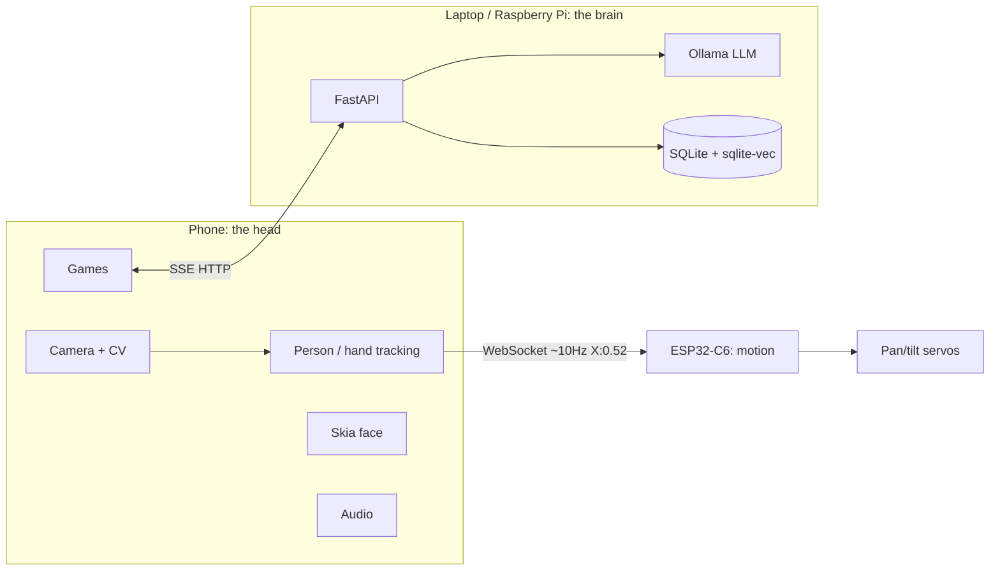

<div align="center">

# DUO

**Rehab shouldn't feel like being alone.**

A mobile rehabilitation companion that turns prescribed movement and
cognitive exercises into playful interactions, giving people in recovery a
reason to move, engage, and feel less alone.

<!-- TODO: drop hero image here -->


<!-- TODO: drop demo GIF here -->


[](LICENSE)
[](app/README.md)
[](app/README.md)
[](server/README.md)
[](#awards)

</div>

> DUO is a wellness and companionship project, not a medical device. It does
> not diagnose, treat, or prescribe, and it doesn't replace a
> physiotherapist. See [`docs/SAFETY.md`](docs/SAFETY.md).

## Quickstart

Three things run: the local model server, the brain (FastAPI), and the phone
app. The ESP32 firmware is optional for a software-only demo.

```bash
# 1. Local model server (Ollama) — see server/README.md for full install
ollama pull llama3.2:3b
ollama pull nomic-embed-text
OLLAMA_HOST=0.0.0.0 ollama serve

# 2. Brain (FastAPI service wrapping Ollama)
cd server
pip install -e ".[dev]"
cp ../.env.example .env   # edit DUO_MODEL etc. if needed
uvicorn duo_server.main:app --host 0.0.0.0 --port 8000

# 3. Phone app (Expo)
cd app
npm install
npx expo prebuild                      # or: eas build --profile development
npx expo start --dev-client
```

**Expo Go will not run this app.** Camera-based tracking
(`react-native-vision-camera` frame processors) needs a development build —
`npx expo prebuild` + a native build, or an EAS development build. See
`app/README.md` for the full explanation and EAS commands.

Firmware (optional, needs an ESP32-C6 + servos): see `firmware/README.md`.

## Why this works

Gamification increases motivation and adherence to repetitive rehab
exercises, and a physically present, socially assistive robot can motivate
engagement in ways a screen alone doesn't (Feil-Seifer & Matarić, 2005;
Carnevale et al., 2025; Dembovski et al., 2022 — full citations in
[`docs/ARCHITECTURE.md`](docs/ARCHITECTURE.md)). DUO leans on that: the same
exercise becomes "help me reach the light" or "keep the beat with me,"
tracked as personal bests and effort, never presented back as a clinical
number. See [`docs/SAFETY.md`](docs/SAFETY.md) for why that framing is
enforced in code, not just stated here.

## Architecture

The phone owns perception, the ESP32 owns motion, the servo creates physical
attention.



Full breakdown — component responsibilities, data flow, memory model, and
an honest note on personalization (system prompt + memory today, LoRA as an
optional future step, not shipped) — in
[`docs/ARCHITECTURE.md`](docs/ARCHITECTURE.md). The phone↔ESP32 message
format is in [`docs/PROTOCOL.md`](docs/PROTOCOL.md).

## Games

Six experiences, each logging sessions/scores through the brain and driving
DUO's face: **Follow Me**, **Air Piano**, **Catch the Light**, **Boxing
Partner**, **F1 Reaction**, **Memory Challenge**. See `app/src/screens/` and
`PLAN.md` Phase 9 for what each tracks.

## Hardware

| Part | Qty | Notes |
| --- | --- | --- |
| Smartphone (the head) | 1 | Camera, audio, face, game UI, on-device CV |
| MG90S micro servo | 2 | Pan (~±40–90°) / tilt (~±30°) gimbal |
| ESP32-C6 (Glyph-C6) | 1 | Wi-Fi motion controller |
| Ultrasonic + motion sensors | 1 each | |
| PVC pipe body, LEGO Inventor base | — | |

Full BOM with part links (in progress): [`docs/HARDWARE.md`](docs/HARDWARE.md).

## Demo

<!-- TODO: drop demo video thumbnail + link here -->
[](https://example.com/duo-demo-video) <!-- TODO: real video URL -->

Full demo runbook lands in Phase 13 (`docs/DEMO.md`).

## Awards

🏆 **Winner, Superhuman Lab Hackathon** — Impact Lab Bengaluru, Aug 8-9,
hosted by Elseplay with Mind Assets, supported by the Claude Code Community.

Team **Int Space**: Vinayak Kempawad, Ankit Kumar, Sanjay Rohith, Abhishek
Raj.

## Safety

DUO is a wellness and companionship project, not a medical device — see
[`docs/SAFETY.md`](docs/SAFETY.md) for the full framing and privacy notes.

## License

MIT for software ([`LICENSE`](LICENSE)). Published hardware design files are
CERN-OHL-S-2.0 ([`LICENSE-HARDWARE`](LICENSE-HARDWARE)).
