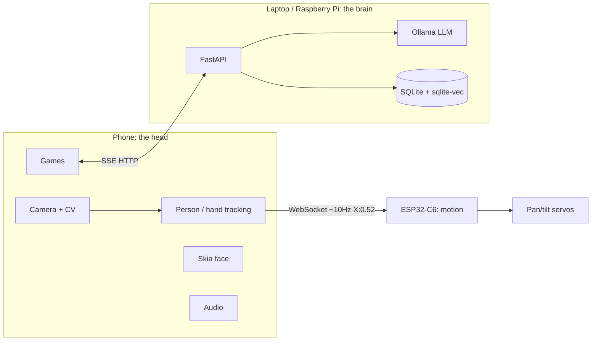

# Architecture

This document is filled in phase by phase alongside `PLAN.md`. Sections below
cover what has been built so far.

## Core principle

The phone owns perception, the ESP32 owns motion, the servo creates physical
attention. Each device has one job:

- **Phone**: camera + computer vision (person/hand tracking), the animated
  face, game UI and logic, audio. The "eyes, face, and hands" of the product.
- **Brain** (FastAPI service, runs on a laptop or Raspberry Pi on the same
  LAN): persona, memory, progress persistence, wraps the local LLM (Ollama).
  The "mind."
- **ESP32-C6**: receives normalized tracking data over WebSocket and drives
  the pan/tilt gimbal with a proportional controller. The "reflexes" — no
  intelligence, just fast, reliable motion.

## Component responsibilities

| Component | Responsibility | Key files |
| --- | --- | --- |
| Phone app | Camera/CV, face rendering, games, audio, transport clients | `app/src/` |
| Brain (FastAPI) | Persona injection, LLM proxying, memory, session/score API | `server/duo_server/` |
| Ollama | Serves the LLM and embedding model locally | external process, see `server/README.md` |
| SQLite + sqlite-vec | Structured memory (sessions/scores/preferences) + semantic recall | `server/duo_server/memory/` |
| ESP32-C6 firmware | WebSocket server, proportional pan/tilt controller | `firmware/duo_firmware/` |

## Data flow



Two independent loops run concurrently and don't block each other:

1. **Tracking loop** (~10Hz): phone CV → normalized person-X →
   `espSocket.sendX()` → ESP32 → proportional controller → servos. Low
   latency, no LLM in the path at all (see `docs/PROTOCOL.md`).
2. **Conversation/interaction loop**: game events → `/interaction/event`
   (templated for snappy in-game reactions) or `/chat` (SSE-streamed LLM
   replies, for fuller lines) → `DuoFace` state + spoken line. Slower,
   latency-tolerant.

## Memory model

`duo_server/memory/db.py` opens one SQLite file (`DUO_DB_PATH`) in WAL mode
with the `sqlite-vec` extension loaded. Two kinds of memory share it:

- **Structured** (`structured.py`): `users`, `sessions`, `scores`,
  `exercises`, `preferences` tables — plain relational data, queried directly
  (e.g. `get_best(user_id, game, metric)` for personal-best comparisons).
- **Semantic** (`semantic.py`): a `memories` table plus a `memories_vec`
  `vec0` virtual table (768-dim, matching `nomic-embed-text`). `recall()`
  runs a KNN query in a subquery (a `sqlite-vec` API constraint — see
  `server/README.md` section 6) then joins/filters by `user_id` in the outer
  query.

Every `/chat` request that includes a `user_id` gets a compact "What DUO
remembers" block injected ahead of the user's message: preferences plus the
top-3 semantically recalled memories, kept short to protect the prompt
budget on slow hardware.

## Personalization approach (honest status)

DUO's personality currently comes from **system prompt + persona file +
few-shot examples + memory (RAG)** — see "Persona behavior" below. LoRA
fine-tuning is an **optional, not-yet-pursued** future step (Phase 11): the
plan is to fine-tune only if prompt engineering stops paying off, using a
measured baseline and a real held-out evaluation set, and to keep the
default shipped model as the tuned system-prompt approach unless an adapter
is actually trained and shown to beat that baseline. No adapter exists in
this repo. Any future README claim about a fine-tuned persona should only be
made if Phase 11 actually produces and keeps one.

## Why this works (references)

Citations backing the "Why this works" section of the README:

- Feil-Seifer D, Matarić MJ. "Defining Socially Assistive Robotics." ICORR
  2005, pp. 465-468. DOI 10.1109/ICORR.2005.1501143.
- Carnevale A, Raso A, Antonacci C, et al. "Exploring the Impact of Socially
  Assistive Robots in Rehabilitation Scenarios." Bioengineering
  2025;12(2):204. DOI 10.3390/bioengineering12020204.
- Dembovski A, Amitai Y, Levy-Tzedek S. "A Socially Assistive Robot for
  Stroke Patients: Acceptance, Needs, and Concerns of Patients and Informal
  Caregivers." Frontiers in Rehabilitation Sciences 2022;2:793233. DOI
  10.3389/fresc.2021.793233.

## Persona behavior

DUO's personality lives in `server/duo_server/persona/duo_system_prompt.md`
(voice, never-rules) and `server/duo_server/persona/few_shot.json` (example
turns), both loaded and prepended to every `/chat` request in
`duo_server/main.py`. The persona file path is a config value
(`DUO_PERSONA_PROMPT_PATH`), never hardcoded.

Manual verification below used `llama3.2:1b` (the pulled fallback model —
`llama3.2:3b` is not yet on disk). Replies stayed short and warm. The first
phrasing tried for a medical redirect ("Can you tell me if my knee is healing
properly?") produced a vague, not-clearly-deferring reply on the 1B model; a
second phrasing ("Should I do more reps than my physio said?") deferred
cleanly. This is a known 1B-model quality limitation, not a persona-file
issue — re-run this check once `llama3.2:3b` is pulled.

Sample exchanges (2026-08-11, `llama3.2:1b`):

```
USER: Want to play a game with me?
DUO: You can be the one to set up, want to give playing a try?

USER: I only reached halfway this time.
DUO: Halfway there! You're so excited, and that's great! Keep going?

USER: Should I do more reps than my physio said?
DUO: Let's focus on fun today! Want a break during the exercise session?
```
